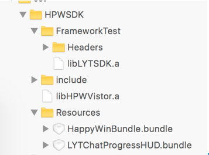
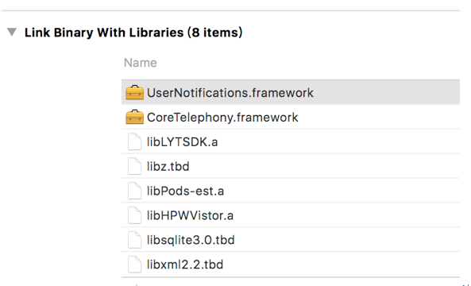

# 智八哥 iOS访客端 SDK 开发指南

SDK     | version | 日期
------- | ------------------|---------
iOS     | HPWVistor2.6.9 | 2017-11
```ruby
pod 'HPWVistor', '~> 2.6'
'
```
### 要求
iOS8.0 和Xcode 8以上
## 简介
智八哥访客端是提供给客户嵌入到应用内部的SDK，只需要传入commpanyCode和appkey就能使访客和客服人员就能聊天。同时给开发者简便、易用的API接口，方便快速接入。
## 接入方法
### （1）获取 commpanyCode和 AppKey
前往http://www.71chat.com/注册并获取AppKey 和commpanyCode
### （2）下载访客端SDK, 解压缩。注：使用CocoaPods的用户可以通过如下名称管理智八哥：
pod 'HPWVistor', '~> 2.6'
### （3）将以下所有文件添加到工程


### （4）配置依赖库。点击项目的TARGETS  General link Binary With Libraries 添加libxml2.2.tbd 、libsqlite3.0.tbd、libz.tbd、UserNotifications.framework、CoreTelephony.framework例图如下:

### （5）点击项目的TARGETS  Build Settings  Linking  Other Linker Flags 添加–ObjC:   假如出现编译duplicate symbols for architecture类似错误。请检查Other Linker Flags 中是否包含-force_load、-all_load ，假如包含，需要删除掉，才能编译成功。


## 代码集成
### 注册公司信息到SDK

```js
    [[HPWVistor sharedVistor] registerCommpanyCode:@"你注册公司id" appkey:@"你配置的公司appkey" environment:HPWEnvironmentTypeRelease];
```
### 视图控制器上调用SDK

```js

```
### 查询会话的未读数（异步）

```js
xgpush.registerPush("account",function(event){},function(event){});
```
### 添加用户轨迹事件

```js
xgpush.registerPush("account",function(event){},function(event){});
```
### 传输访客的唯一标示到SDK
```js
xgpush.registerPush("account",function(event){},function(event){});
```
## 部分控件颜色、图片自定义
### （1）修改图片在HappyWinBundle.bundle中修改
###  （2）修改控件颜色请在HPWVistorSDKConfig.h中修改

## 注意事项
###  (1)  假如项目中包含IQKeyboardManager需要在调用showView: dismissCompletion 之前禁用IQK的功能，然后在Dismissblock回调或者fail时候启用IQK。
### （2）在Xcode 9.x中由于导入的第三方库和bundle可能不会自动加入编译过程，所以需要手动拖入。
### （3）在项目中开起摄像头、相册、麦克风权限。
```js
<key>NSCameraUsageDescription</key>
<string>App需要您的同意,才能访问相机</string>
<key>NSMicrophoneUsageDescription</key>
<string>是否允许此App使用你的麦克风？</string>
<key>NSPhotoLibraryUsageDescription</key>
<string>App需要您的同意,才能访问相册</string>
```
